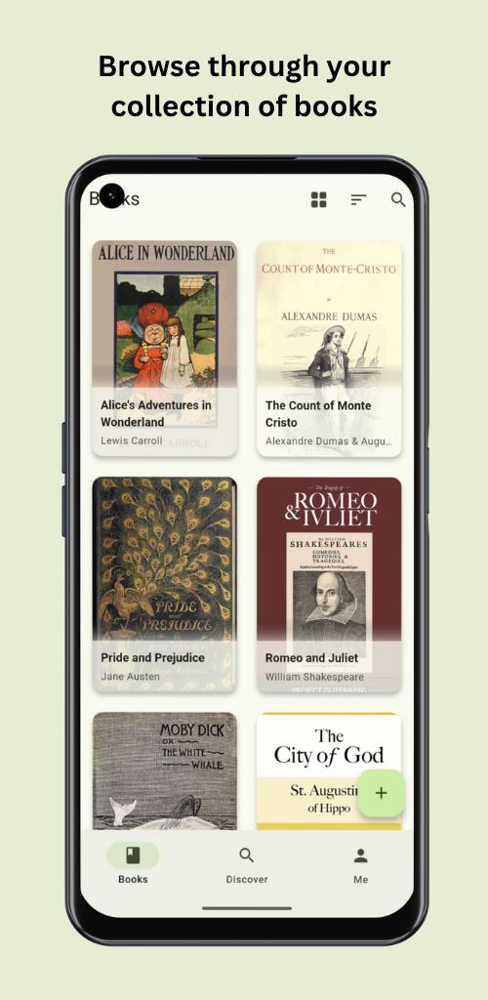
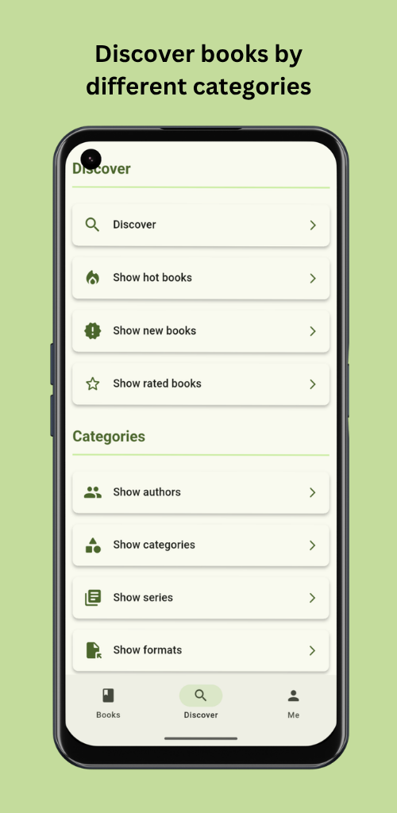
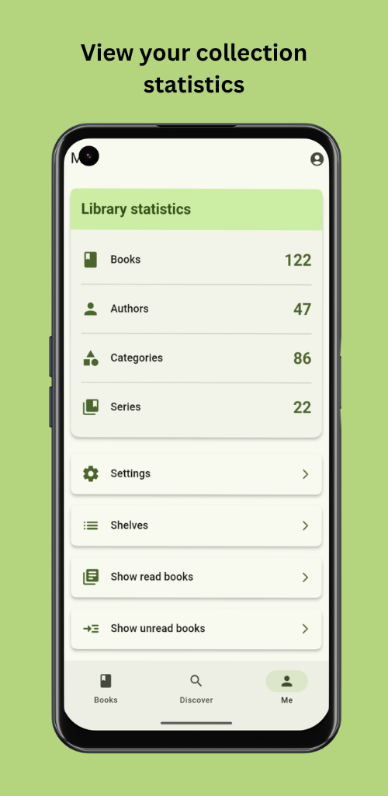
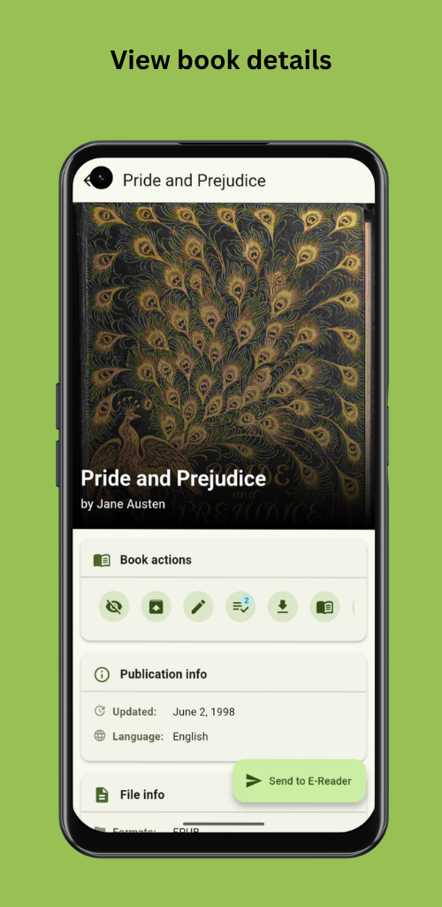
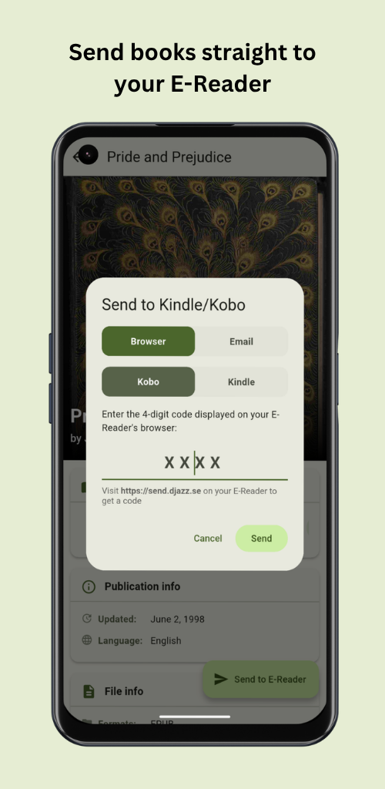
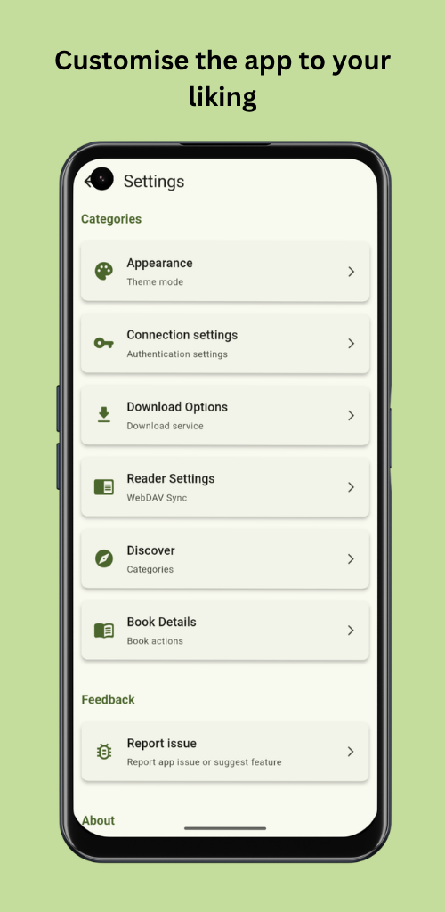

> [!CAUTION]
> ‼️ Android will become a locked-down platform. Learn more: https://keepandroidopen.org/

    
     
    v2.2.0

    
    
    
    
    
    

# Calibre Web Companion

This is an unofficial companion application for [Calibre Web](https://github.com/janeczku/calibre-web) (which also works for [Calibre Web Automated](https://github.com/crocodilestick/Calibre-Web-Automated), [Grimmory](https://github.com/grimmory-tools/grimmory), [Calibre 'Sharing over the net'](https://github.com/kovidgoyal/calibre) and other OPDS providers (beta)), that allows you to browse your book collection and download books directly to your device. You can also interact with your books by marking them as read, unread or bookmarked. It is also possible to send books directly to your e-reader (Kindle/Kobo) thanks to the great work of [send2ereader](https://github.com/daniel-j/send2ereader).

The app is built with [Flutter](https://github.com/flutter/flutter) and uses **Material You**. It is currently available for **Android** only.

## 📦 Installation

    
    
    
    

## 💪 Features

- Connect to your Calibre-Web (Automated), Grimmory, Calibre and OPDS servers, including reverse proxy/SSO setups, custom HTTP headers and self-signed certificates.
- Browse your whole library with smooth, fast navigation.
- Discover books by category, authors, series, publishers, ratings, hot & trending, and more.
- View rich details for every book, edit its metadata, and upload new covers.
- Mark books as read or unread, archive them, and organize them into shelves.
- Create, edit and browse Magic Shelves, dynamic, rule‑based shelves (Calibre‑Web Automated only).
- Add books quickly by scanning their ISBN barcode.
- Read books in the built‑in eBook reader and sync your reading progress across devices via WebDAV.
- Send books to your e‑reader via [send2ereader](https://github.com/daniel-j/send2ereader) (or your own instance) or Calibre‑Web's email function.
- Download books straight into your collection with [shelfmark](https://github.com/calibrain/shelfmark).
  - ⚠️ This app does **not** support, encourage or facilitate the piracy of copyrighted works. Please only download content you are legally entitled to, respecting copyright is your responsibility.
- Upload books to your Calibre‑Web server.
- Sync your whole library or selected books for offline reading.
- Check your collection statistics at a glance.
- Make it yours: reorder or hide book actions, detail sections and Discover sections, choose a theme, enable e‑ink mode, and adjust the text size, available in 15 languages.

## 🖼️ Impressions

    
    
    
    
    
    

## 🌍 l10n

You can help translate Calibre Web Companion on [Weblate](https://hosted.weblate.org/projects/calibre-web-companion/app/).

## 🚀 Contributing

You can of course open issues for bugs, feedback, and feature ideas. All suggestions are very welcome :)

The source code is also mirrored on [Codeberg](https://codeberg.org/doen1el/calibre-web-companion). GitHub remains the primary repository, so please open issues and pull requests here.

## 📜 Credits

- [Calibre Web](https://github.com/janeczku/calibre-web)
- [Calibre Web Automated](https://github.com/crocodilestick/Calibre-Web-Automated)
- [shelfmark](https://github.com/calibrain/shelfmark)
- [send2ereader](https://github.com/daniel-j/send2ereader)
- [Flutter](https://github.com/flutter/flutter)
- [IconKitchen](https://icon.kitchen)
- [Weblate](https://hosted.weblate.org/)
- [CosmosEpub](https://github.com/Mamasodikov/cosmos_epub)
